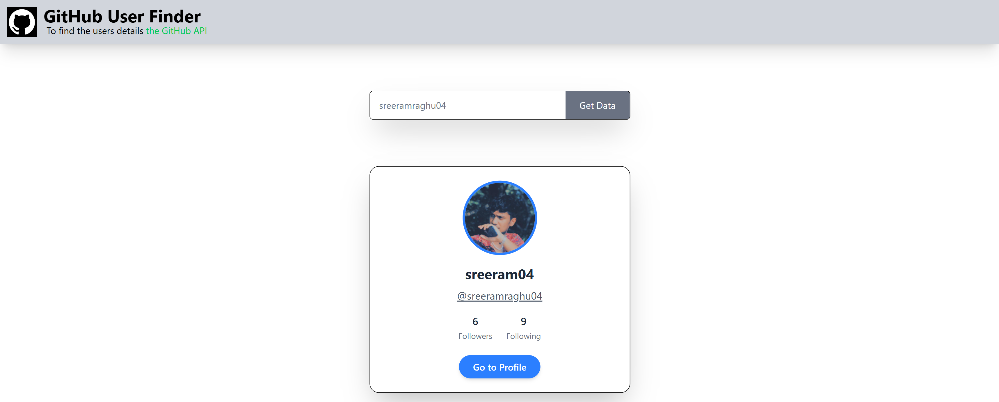

# GitHub User Finder

A simple and responsive web application built with **React**, **Axios**, and **Tailwind CSS** that allows users to search and view GitHub profiles by username. It utilizes the GitHub public API to fetch and display user information dynamically.

## 🚀 Features

- 🔎 Search for any GitHub user by username
- 📄 Displays user details including:
  - Profile picture
  - Name and username
  - Followers and following count
  - Link to their GitHub profile
- 💅 Styled with Tailwind CSS for a clean and modern UI
- ⚡ Fast API fetching using Axios
- 🔁 Reusable components using props

## 🛠️ Tech Stack

- **React** – UI Library
- **Axios** – HTTP client for API calls
- **Tailwind CSS** – Utility-first CSS framework for styling
- **GitHub API** – For fetching user data

## Screenshots

- Large Screen
  

- Small Screen
  

## links

- [Live Demo](https://ram-react-githubuserfinder.netlify.app/)
